```mermaid
flowchart LR
    direction LR
    subgraph 1[" "]
        direction TB
        top1[Find Raz's Profile] --> bottom1[Hire Raz 🤝]
    end
    subgraph 2[" "]
        direction TB
        top2[Google Endlessly 🔎] --> bottom2[Waste Time ⌛]
    end

    %% Link to subgraph1
    3[Discover Problem 🐛] --> 1

    %% Link within subgraph2
    3[Discover Problem 🐛] --> 2

    1 --> outside1["Profit" 📈]
    2 --> outside2["No solution" 😢]

    click top1 "https://github.com/RazEini" "GitHub Profile"

    style 1 stroke:#072ff7,stroke-width:5px
    style 2 stroke:#f70707,stroke-width:5px
```

<h1 align="center">
  Hi, I’m Raz Eini 👋
</h1>

 

<ul>
<li>I'm a <strong>Software Developer</strong> crafting <strong>Android, Backend, and Cross-Platform Apps</strong>. I enjoy transforming ideas into <strong>apps that are intuitive, practical, and enjoyable</strong>.</li>
<li>I focus on <strong>solving problems elegantly</strong> and ensuring systems run smoothly, striving for <strong>clean and efficient solutions</strong>.</li>
<li>I'm constantly exploring <strong>new technologies</strong> to refine my skills and bring fresh perspectives to my work.</li>
<li>Beyond coding, I pursue side projects, experiment with ideas, and enjoy collaborating to create products that people genuinely value.</li>
</ul>

<h4 align="center">
  <i>*“🧠 Writing code that works — and occasionally keeps me entertained.”*  
  *🧩 Simplicity is my favorite feature.*</i>
</h4>

 

<h2 align="center">👨‍💻 About Me</h2>

<table>
<tr>
<td align="center" width="999">
 

📠Currently part of the <strong>Academic Reserve Program (Atuda)</strong> in Software Engineering.  
🚀 Always learning new technologies — currently focusing on <strong>mobile app development</strong>.  
💬 Ask me about <strong>Android, Java, Python, or full-stack app architecture</strong>.  
📫 Reach me at: <a href="mailto:razeini972@gmail.com"><strong>razeini972@gmail.com</strong></a>  
🌠Portfolio: <a href="https://RazEini.github.io" target="_blank"><strong>RazEini.github.io</strong></a>  

</td>
</tr>
</table>

 

<table>
<tr>
<td width="999">
<h2 align="center">Languages, Frameworks & Tools</h2>

  
  
  
  
  
  
  
  
  
  
  
  
  
  

 

<h2 align="center">📚 Planning To Learn</h2>

  
  

</td>
</tr>
</table>

 

<h2 align="center">📂 Projects & Learnings</h2>

<!-- Desktop Table -->

  <table align="center">
    <thead>
      <tr>
        <th>Project</th>
        <th>What I Learned</th>
        <th>Technologies</th>
        <th>Description</th>
        <th>Link</th>
      </tr>
    </thead>
    <tbody>
      <tr>
        <td>E-Commerce Shop</td>
        <td>User authentication, live cart, admin panel, real-time database, smart & voice search</td>
        <td align="center">
          
          
          
        </td>
        <td>Online Android store app with client & user panels, admin dashboard, live shopping cart, notifications, and full Firebase integration</td>
        <td align="center">
          <a href="https://github.com/RazEini/e_commerce_shop" target="_blank">GitHub</a></td>
      </tr>
      <tr>
        <td>Tetris Game</td>
        <td>Game loops, animations, event handling, OOP, leaderboard system</td>
        <td align="center">
          
        </td>
        <td>Classic desktop Tetris game with smooth animations, music, multiple difficulty levels, and interactive leaderboard</td>
        <td align="center">
          <a href="https://github.com/RazEini/Tetris" target="_blank">GitHub</a></td>
      </tr>
      <tr>
        <td>TaskFlow – Smart Task Manager</td>
        <td>Jetpack Compose UI, MVVM, rule-based task prioritization, state management</td>
        <td align="center">
          
          
          
        </td>
        <td>Smart task manager app with automated prioritization, category filtering, dashboard overview, and task CRUD operations</td>
        <td align="center">
          <a href="https://github.com/RazEini/Smart_Task_Flow" target="_blank">GitHub</a></td>
      </tr>
      <tr>
        <td>Python Password Manager</td>
        <td>Encryption (AES-128-GCM), secure storage, CLI & GUI development, master password, password strength validation</td>
        <td align="center">
          
        </td>
        <td>Secure password manager with encrypted JSON Vault, CLI & GUI interfaces, master password, password generation, and copy-to-clipboard functionality</td>
        <td align="center">
          <a href="https://github.com/RazEini/Password_Manager" target="_blank">GitHub</a></td>
      </tr>
    </tbody>
  </table>

 

  
📱 View Projects for Mobile

   

  <h2 align="center">📂 Projects & Learnings</h2>

  

    
<b>E-Commerce Shop</b>

    <table>
      <tr>
        <td><b>What I Learned:</b></td>
        <td>User authentication, live cart, admin panel, real-time database, smart & voice search</td>
      </tr>
      <tr>
        <td><b>Technologies:</b></td>
        <td>
          
          
          
        </td>
      </tr>
      <tr>
        <td><b>Description:</b></td>
        <td>Online Android store app with client & user panels, admin dashboard, live shopping cart, notifications, and full Firebase integration</td>
      </tr>
      <tr>
        <td><b>Link:</b></td>
        <td>
          <a href="https://github.com/RazEini/e_commerce_shop" target="_blank">
            
            GitHub Repo
          </a>
        </td>
      </tr>
    </table>
  

   

  

    
<b>Tetris Game</b>

    <table>
      <tr>
        <td><b>What I Learned:</b></td>
        <td>Game loops, animations, event handling, OOP, leaderboard system</td>
      </tr>
      <tr>
        <td><b>Technologies:</b></td>
        <td>
          
        </td>
      </tr>
      <tr>
        <td><b>Description:</b></td>
        <td>Classic desktop Tetris game with smooth animations, music, multiple difficulty levels, and interactive leaderboard</td>
      </tr>
      <tr>
        <td><b>Link:</b></td>
        <td>
          <a href="https://github.com/RazEini/Tetris" target="_blank">
            
            GitHub Repo
          </a>
        </td>
      </tr>
    </table>
  

   

  

    
<b>TaskFlow – Smart Task Manager</b>

    <table>
      <tr>
        <td><b>What I Learned:</b></td>
        <td>Jetpack Compose UI, MVVM, rule-based task prioritization, state management</td>
      </tr>
      <tr>
        <td><b>Technologies:</b></td>
        <td>
          
          
          
        </td>
      </tr>
      <tr>
        <td><b>Description:</b></td>
        <td>Smart task manager app with automated prioritization, category filtering, dashboard overview, and task CRUD operations</td>
      </tr>
      <tr>
        <td><b>Link:</b></td>
        <td>
          <a href="https://github.com/RazEini/Smart_Task_Flow" target="_blank">
            
            GitHub Repo
          </a>
        </td>
      </tr>
    </table>
  

   

  

    
<b>Python Password Manager</b>

    <table>
      <tr>
        <td><b>What I Learned:</b></td>
        <td>Encryption (AES-128-GCM), secure storage, CLI & GUI development, master password, password strength validation</td>
      </tr>
      <tr>
        <td><b>Technologies:</b></td>
        <td>
          
        </td>
      </tr>
      <tr>
        <td><b>Description:</b></td>
        <td>Secure password manager with encrypted JSON Vault, CLI & GUI interfaces, master password, password generation, and copy-to-clipboard functionality</td>
      </tr>
      <tr>
        <td><b>Link:</b></td>
        <td>
          <a href="https://github.com/RazEini/Password_Manager" target="_blank">
            
            GitHub Repo
          </a>
        </td>
      </tr>
    </table>
  

 

<h2 align="center">📊 GitHub Stats</h2>

 

  <!-- GitHub Stats -->
  <picture>
    <source 
      media="(prefers-color-scheme: dark)" 
      srcset="https://github-readme-stats.vercel.app/api?username=RazEini&show_icons=true&rank_icon=github&include_all_commits=true&count_private=true&theme=tokyonight&bg_color=00000000" 
    />
    <source 
      media="(prefers-color-scheme: light)" 
      srcset="https://github-readme-stats.vercel.app/api?username=RazEini&show_icons=true&rank_icon=github&include_all_commits=true&count_private=true&theme=graywhite&bg_color=ffffff&title_color=0d1117&text_color=333333&icon_color=0078ff" 
    />
    
  </picture>

  <!-- Top Languages -->
  <picture>
    <source 
      media="(prefers-color-scheme: dark)" 
      srcset="https://github-readme-stats.vercel.app/api/top-langs?username=RazEini&layout=compact&langs_count=8&theme=tokyonight&bg_color=00000000"
    />
    <source 
      media="(prefers-color-scheme: light)" 
      srcset="https://github-readme-stats.vercel.app/api/top-langs?username=RazEini&layout=compact&langs_count=8&theme=graywhite&bg_color=ffffff&title_color=0d1117&text_color=333333&icon_color=0078ff"
    />
    
  </picture>

 

<table>
<tr>
<td align="center" width="999">
<h2 align="center">💡 Why Hire Me?</h2>

</td>
</tr>
</table>

 

<table>
<tr>
<td width="999">

  <h2>💬 Why Hire Me (Seriously)</h2>
    
✅ <strong>Clean, maintainable code</strong> with real-world scalability

    
🨠<strong>Strong design sense</strong> and focus on user experience

    
⚡ <strong>Fast learner</strong> with deep curiosity about new tech

    
🤠<strong>Collaborative, detail-oriented</strong>, driven to build impactful products

</td>
</tr>
</table>

 

 

<h2>📌 Professional Profile & Contact</h2>

 

 

 

 

&copy; 2025 <strong>Raz Eini</strong>. All rights reserved. ⚡

